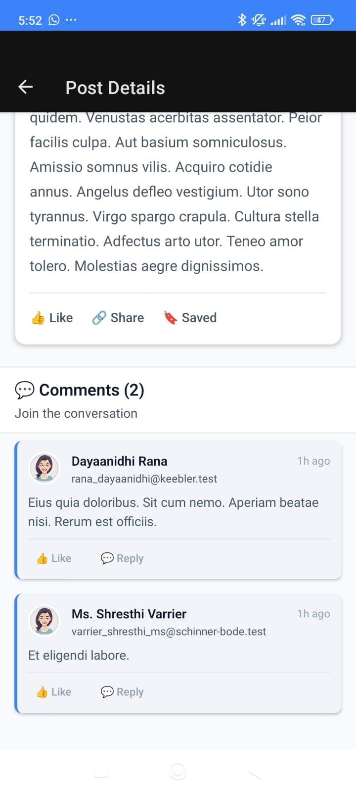
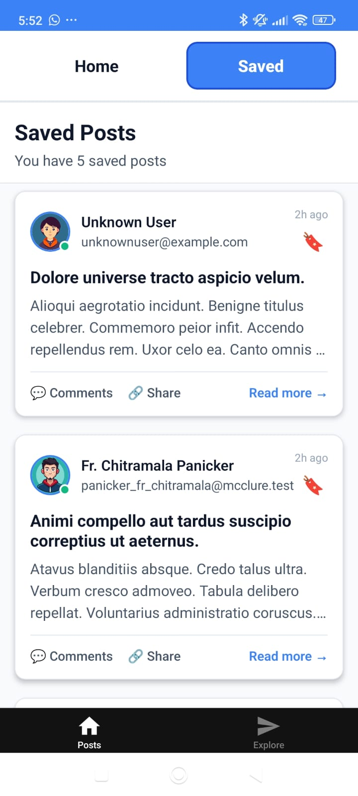
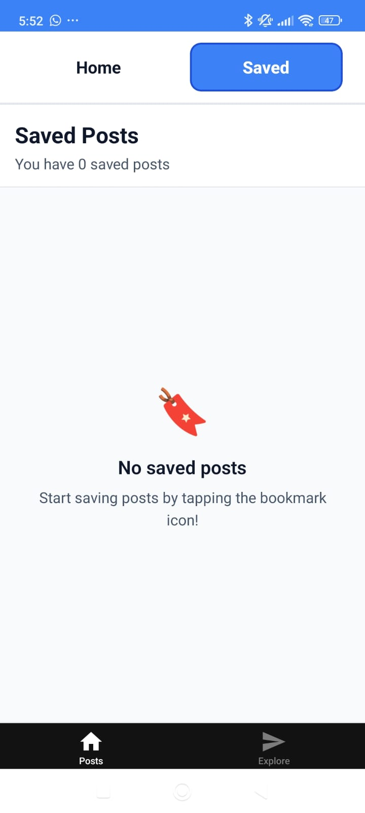

1- To run fist install dependencies:
   npm install

2- Then to start the run:
   npx expo start

3- Install expo go to scan the QR code to run the app or press w to run on pc

*It took 30 minutes to setup expo, and 1 hour and 35 minutes to finish this project

